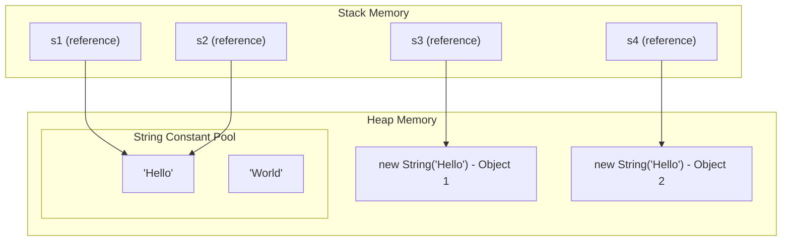
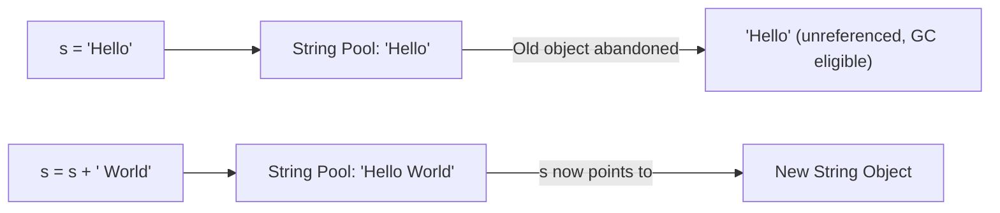
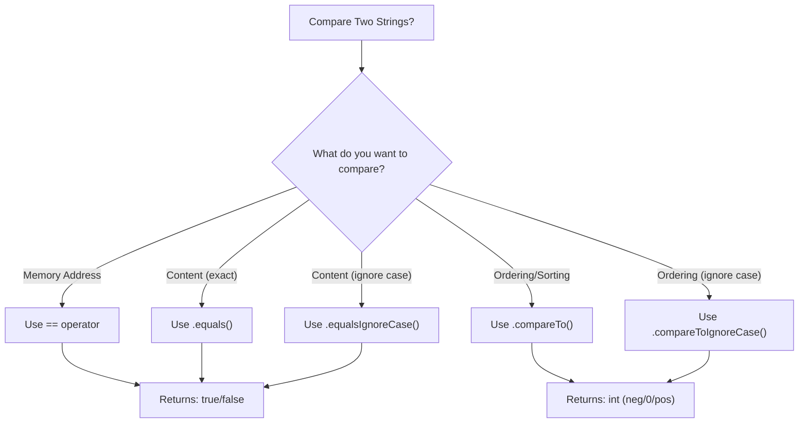
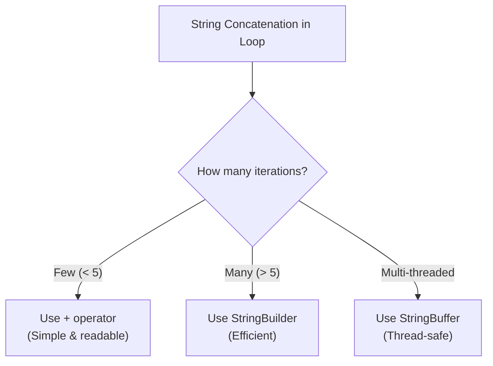
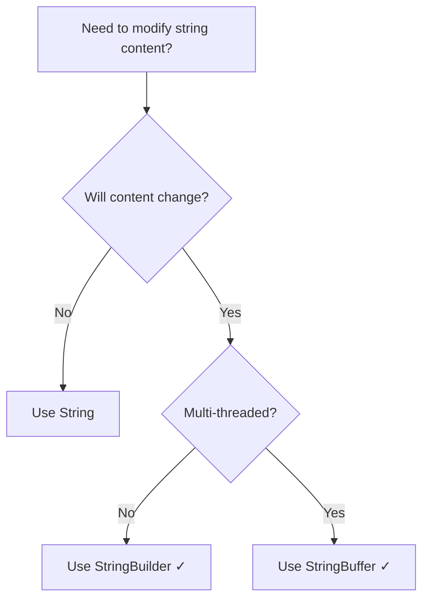
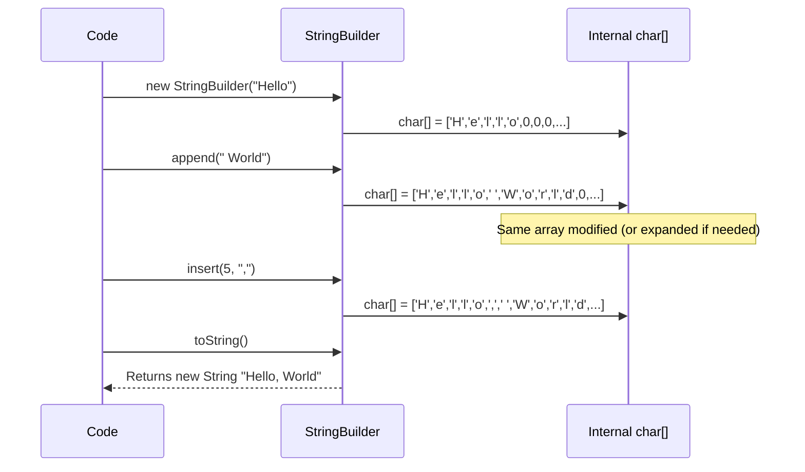

# Strings in Java - Complete Beginner-Friendly Notes

---

## Table of Contents

1. [What is a String in Java?](#what-is-a-string-in-java)
2. [Different Ways to Create Strings](#different-ways-to-create-strings)
3. [String Memory Management](#string-memory-management)
4. [Immutability of Strings](#immutability-of-strings)
5. [Why Strings are Immutable](#why-strings-are-immutable-in-java)
6. [String Comparison](#string-comparison)
7. [Common String Methods](#common-string-methods)
8. [String Concatenation](#string-concatenation)
9. [StringBuilder and StringBuffer](#stringbuilder-and-stringbuffer)
10. [String Formatting](#string-formatting)
11. [String Conversion](#string-conversion)
12. [String and Character Operations](#string-and-character-operations)
13. [Regular Expressions with Strings](#regular-expressions-with-strings)
14. [String Joining and Collecting](#string-joining-and-collecting)
15. [Useful String Interview Questions](#useful-string-interview-questions)
16. [Common Mistakes Beginners Make](#common-mistakes-beginners-make-with-strings)
17. [Best Practices](#best-practices-for-using-strings-in-java)
18. [Practice Problems with Solutions](#practice-problems-with-solutions)

---

## What is a String in Java?

A **String** in Java is a sequence of characters. It is one of the most commonly used data types in Java programming.

### Key Facts:
- String is a **class** in Java (not a primitive type like `int` or `char`)
- It belongs to the `java.lang` package (auto-imported)
- String objects are **immutable** (cannot be changed once created)
- Strings are stored in a special memory area called the **String Constant Pool**

### Real-World Analogy:
> Think of a String like a **name plate on a door**. Once engraved, you can't modify the letters — you'd have to get a new plate entirely. Similarly, once a String is created, its content cannot be changed.

```java
// A simple String
String greeting = "Hello, World!";
System.out.println(greeting); // Output: Hello, World!
```

### String Class Hierarchy:

```
java.lang.Object
    └── java.lang.String (implements Serializable, Comparable<String>, CharSequence)
```

---

## Different Ways to Create Strings

There are **two primary ways** to create a String in Java:

### 1. String Literal (Recommended)

```java
String name = "Java";
```

- Created in the **String Constant Pool** (a special area inside heap memory)
- If the same literal already exists in the pool, Java **reuses** it (no duplicate is created)
- More memory efficient

### 2. Using the `new` Keyword

```java
String name = new String("Java");
```

- Always creates a **new object in heap memory**
- Does NOT check the String Constant Pool first for reuse
- Less memory efficient (avoid unless needed)

### Comparison of Both Approaches:

| Feature | String Literal | `new String()` |
|---------|---------------|----------------|
| Storage | String Constant Pool | Heap Memory |
| Reusability | Yes (same object reused) | No (always new object) |
| Performance | Better | Slightly worse |
| Memory Usage | Efficient | Less efficient |
| Recommended | ✅ Yes | ❌ Avoid unless needed |

### Example:

```java
public class StringCreation {
    public static void main(String[] args) {
        // Using String literal
        String s1 = "Hello";
        String s2 = "Hello";
        
        // Using new keyword
        String s3 = new String("Hello");
        String s4 = new String("Hello");
        
        // s1 and s2 point to the SAME object in pool
        System.out.println(s1 == s2); // true
        
        // s3 and s4 are DIFFERENT objects in heap
        System.out.println(s3 == s4); // false
        
        // s1 and s3 are in different memory locations
        System.out.println(s1 == s3); // false
    }
}
```

---

## String Memory Management

Understanding how Strings are stored in memory is crucial for writing efficient Java code.

### String Constant Pool (SCP)

- A **special memory area** inside the Heap where string literals are stored
- Also called "String Pool" or "String Intern Pool"
- When you create a string literal, Java checks if the same value already exists in the pool
- If it exists → returns the reference to the existing object
- If it doesn't exist → creates a new entry in the pool

### Heap Memory

- When you use `new String()`, the object is created in the **regular heap** (outside the pool)
- Each `new` call creates a separate object even if the content is the same

### Memory Diagram (Mermaid):



### ASCII Diagram:

```
STACK                          HEAP
┌─────────┐                   ┌───────────────────────────────────────┐
│  s1 ────┼───────────┐      │                                       │
├─────────┤           │      │   ┌─────────────────────────────┐     │
│  s2 ────┼───────────┤      │   │   String Constant Pool      │     │
├─────────┤           ├──────┼──▶│   ┌───────────────────┐     │     │
│  s3 ────┼─────┐     │      │   │   │   "Hello"         │     │     │
├─────────┤     │     │      │   │   └───────────────────┘     │     │
│  s4 ────┼──┐  │            │   │   ┌───────────────────┐     │     │
└─────────┘  │  │            │   │   │   "World"         │     │     │
             │  │            │   │   └───────────────────┘     │     │
             │  │            │   └─────────────────────────────┘     │
             │  │            │                                       │
             │  │            │   ┌───────────────────┐               │
             │  └────────────┼──▶│ new String("Hello")│ (Object 1)  │
             │               │   └───────────────────┘               │
             │               │   ┌───────────────────┐               │
             └───────────────┼──▶│ new String("Hello")│ (Object 2)  │
                             │   └───────────────────┘               │
                             └───────────────────────────────────────┘
```

### The `intern()` Method

The `intern()` method moves a String from heap to the String Pool (or returns the pool reference if already there):

```java
String s1 = new String("Hello");  // Created in heap
String s2 = s1.intern();          // Now points to pool
String s3 = "Hello";              // Points to pool

System.out.println(s2 == s3);     // true (both point to pool)
System.out.println(s1 == s3);     // false (s1 is in heap)
```

---

## Immutability of Strings

### What is Immutability?

**Immutable** means "cannot be changed." Once a String object is created, its content **cannot be modified**.

### Real-World Analogy:
> Think of a String like a **printed book**. Once printed, you can't change the words on a page. If you want different content, you must print a **new book**. Similarly, any "modification" to a String actually creates a brand new String object.

### Proof of Immutability:

```java
public class ImmutabilityDemo {
    public static void main(String[] args) {
        String original = "Hello";
        System.out.println("Original: " + original);           // Hello
        System.out.println("HashCode: " + original.hashCode()); // 69609650
        
        // This does NOT modify original - creates a NEW String
        String modified = original.concat(" World");
        
        System.out.println("Original after concat: " + original); // Hello (unchanged!)
        System.out.println("Modified: " + modified);              // Hello World
        System.out.println("Same object? " + (original == modified)); // false
    }
}
```

### What Happens When You "Modify" a String:

```java
String s = "Hello";
s = s + " World";  // "Hello" is NOT modified; a NEW String "Hello World" is created
                    // The old "Hello" becomes eligible for garbage collection
                    // (if no other reference points to it)
```

### Immutability Flow (Mermaid):



### Important Note:
> ⚠️ The **reference variable** can be changed to point to a different String object, but the **String object itself** cannot be altered in memory.

---

## Why Strings are Immutable in Java

There are several important reasons why Java designers made Strings immutable:

### 1. String Pool Optimization
- Multiple references can safely share the same String in the pool
- If Strings were mutable, changing one would affect all references

### 2. Security
- Strings are used for sensitive data: file paths, network URLs, database connections, usernames
- Immutability prevents tampering after validation

### 3. Thread Safety
- Immutable objects are inherently thread-safe
- Multiple threads can share Strings without synchronization

### 4. Caching of HashCode
- String caches its `hashCode()` on first computation
- Since content never changes, the hash remains valid
- Makes Strings efficient as HashMap keys

### 5. Class Loading Security
- Class names are Strings
- Immutability ensures the class loading mechanism is secure

```java
// Example: Security benefit
public void connectToDatabase(String url) {
    // After security check, the url cannot be changed
    // because Strings are immutable
    if (isValidUrl(url)) {
        // url is guaranteed to still be the validated value
        database.connect(url);
    }
}
```

---

## String Comparison

### Overview of Comparison Methods:

| Method | Compares | Case Sensitive | Returns |
|--------|----------|---------------|---------|
| `==` | Reference (memory address) | N/A | `boolean` |
| `equals()` | Content (characters) | Yes | `boolean` |
| `equalsIgnoreCase()` | Content (characters) | No | `boolean` |
| `compareTo()` | Lexicographic order | Yes | `int` |
| `compareToIgnoreCase()` | Lexicographic order | No | `int` |

---

### 1. `==` Operator (Reference Comparison)

Checks if two references point to the **same object in memory**.

```java
String s1 = "Hello";
String s2 = "Hello";
String s3 = new String("Hello");

System.out.println(s1 == s2); // true (same object in pool)
System.out.println(s1 == s3); // false (different objects)
```

> ⚠️ **Never use `==` to compare String content!** It checks memory addresses, not values.

---

### 2. `equals()` (Content Comparison)

Checks if two Strings have the **same characters** (case-sensitive).

```java
String s1 = "Hello";
String s2 = new String("Hello");
String s3 = "hello";

System.out.println(s1.equals(s2)); // true (same content)
System.out.println(s1.equals(s3)); // false (case differs)
```

---

### 3. `equalsIgnoreCase()` (Case-Insensitive Content Comparison)

```java
String s1 = "Hello";
String s2 = "hello";
String s3 = "HELLO";

System.out.println(s1.equalsIgnoreCase(s2)); // true
System.out.println(s1.equalsIgnoreCase(s3)); // true
```

---

### 4. `compareTo()` (Lexicographic Comparison)

Returns:
- `0` → if both strings are equal
- **Negative** → if calling string comes before the argument
- **Positive** → if calling string comes after the argument

```java
String a = "Apple";
String b = "Banana";
String c = "Apple";

System.out.println(a.compareTo(b)); // negative (A < B)
System.out.println(b.compareTo(a)); // positive (B > A)
System.out.println(a.compareTo(c)); // 0 (equal)
```

---

### 5. `compareToIgnoreCase()` (Case-Insensitive Lexicographic)

```java
String s1 = "apple";
String s2 = "APPLE";

System.out.println(s1.compareToIgnoreCase(s2)); // 0 (equal ignoring case)
```

---

### Comparison Flow (Mermaid):



---

## Common String Methods

### Quick Reference Table:

| Method | Description | Example | Result |
|--------|-------------|---------|--------|
| `length()` | Returns number of characters | `"Hello".length()` | `5` |
| `charAt(i)` | Returns char at index i | `"Hello".charAt(1)` | `'e'` |
| `substring(i)` | Returns substring from index i | `"Hello".substring(2)` | `"llo"` |
| `substring(i,j)` | Returns substring from i to j-1 | `"Hello".substring(1,4)` | `"ell"` |
| `contains(s)` | Checks if contains substring | `"Hello".contains("ell")` | `true` |
| `startsWith(s)` | Checks prefix | `"Hello".startsWith("He")` | `true` |
| `endsWith(s)` | Checks suffix | `"Hello".endsWith("lo")` | `true` |
| `indexOf(s)` | First occurrence index | `"Hello".indexOf('l')` | `2` |
| `lastIndexOf(s)` | Last occurrence index | `"Hello".lastIndexOf('l')` | `3` |
| `toUpperCase()` | Converts to uppercase | `"Hello".toUpperCase()` | `"HELLO"` |
| `toLowerCase()` | Converts to lowercase | `"Hello".toLowerCase()` | `"hello"` |
| `trim()` | Removes leading/trailing spaces | `" Hi ".trim()` | `"Hi"` |
| `strip()` | Removes leading/trailing whitespace (Unicode-aware) | `" Hi ".strip()` | `"Hi"` |
| `replace(a,b)` | Replaces all occurrences of a with b | `"Hello".replace('l','p')` | `"Heppo"` |
| `split(regex)` | Splits string by delimiter | `"a,b,c".split(",")` | `["a","b","c"]` |
| `concat(s)` | Concatenates strings | `"Hello".concat(" World")` | `"Hello World"` |
| `isEmpty()` | Checks if length is 0 | `"".isEmpty()` | `true` |
| `isBlank()` | Checks if empty or only whitespace | `"  ".isBlank()` | `true` |

---

### Detailed Examples:

#### `length()`
Returns the number of characters in the string.

```java
String s = "Java Programming";
System.out.println(s.length()); // 16 (spaces count!)
System.out.println("".length()); // 0
```

---

#### `charAt(int index)`
Returns the character at the specified index (0-based).

```java
String s = "Hello";
System.out.println(s.charAt(0)); // 'H'
System.out.println(s.charAt(4)); // 'o'
// s.charAt(5); // StringIndexOutOfBoundsException!
```

> ⚠️ Index starts from **0**, not 1. Last index is `length() - 1`.

---

#### `substring(int beginIndex)` and `substring(int beginIndex, int endIndex)`
Extracts a portion of the string.

```java
String s = "Hello World";
System.out.println(s.substring(6));      // "World" (from index 6 to end)
System.out.println(s.substring(0, 5));   // "Hello" (from 0 to 4, endIndex is exclusive)
System.out.println(s.substring(3, 8));   // "lo Wo"
```

> 📝 **Note:** `endIndex` is **exclusive** — the character at `endIndex` is NOT included.

---

#### `contains(CharSequence s)`
Checks if the string contains the specified sequence.

```java
String s = "Java is awesome";
System.out.println(s.contains("awesome")); // true
System.out.println(s.contains("Awesome")); // false (case-sensitive)
System.out.println(s.contains(""));        // true (empty string is always contained)
```

---

#### `startsWith(String prefix)` and `endsWith(String suffix)`

```java
String file = "report.pdf";
System.out.println(file.startsWith("report")); // true
System.out.println(file.endsWith(".pdf"));      // true
System.out.println(file.endsWith(".doc"));      // false
```

---

#### `indexOf(String str)` and `lastIndexOf(String str)`

```java
String s = "Java is great and Java is fun";
System.out.println(s.indexOf("Java"));      // 0 (first occurrence)
System.out.println(s.lastIndexOf("Java"));  // 18 (last occurrence)
System.out.println(s.indexOf("Python"));    // -1 (not found)
System.out.println(s.indexOf("is", 6));     // 5 (search from index 6... wait)

// indexOf with fromIndex
String text = "abcabc";
System.out.println(text.indexOf("abc", 1)); // 3 (starts searching from index 1)
```

---

#### `toUpperCase()` and `toLowerCase()`

```java
String s = "Hello World";
System.out.println(s.toUpperCase()); // "HELLO WORLD"
System.out.println(s.toLowerCase()); // "hello world"
System.out.println(s);               // "Hello World" (original unchanged!)
```

---

#### `trim()` vs `strip()`

Both remove leading and trailing whitespace, but `strip()` (Java 11+) is Unicode-aware.

```java
String s = "   Hello World   ";
System.out.println(s.trim());    // "Hello World"
System.out.println(s.strip());   // "Hello World"

// strip() also has variants:
System.out.println(s.stripLeading());  // "Hello World   "
System.out.println(s.stripTrailing()); // "   Hello World"

// Difference with Unicode whitespace:
String unicode = "\u2000 Hello \u2000"; // Unicode space character
System.out.println(unicode.trim());     // May NOT remove Unicode spaces
System.out.println(unicode.strip());    // Removes Unicode spaces ✓
```

---

#### `replace()`

```java
String s = "Java is fun";
System.out.println(s.replace('a', 'o'));          // "Jovo is fun"
System.out.println(s.replace("fun", "awesome"));  // "Java is awesome"
System.out.println(s.replaceAll("[aeiou]", "*")); // "J*v* *s f*n" (regex)
System.out.println(s.replaceFirst("a", "X"));     // "JXva is fun" (only first)
```

---

#### `split(String regex)`

```java
String csv = "apple,banana,cherry";
String[] fruits = csv.split(",");
// fruits = ["apple", "banana", "cherry"]

for (String fruit : fruits) {
    System.out.println(fruit);
}

// Split with limit
String s = "one:two:three:four";
String[] parts = s.split(":", 2); // Split into max 2 parts
// parts = ["one", "two:three:four"]

// Split by whitespace
String sentence = "Hello   World   Java";
String[] words = sentence.split("\\s+"); // \\s+ matches one or more whitespace
// words = ["Hello", "World", "Java"]
```

---

#### `concat(String str)`

```java
String s1 = "Hello";
String s2 = s1.concat(" World");
System.out.println(s2); // "Hello World"
System.out.println(s1); // "Hello" (original unchanged)
```

---

#### `isEmpty()` vs `isBlank()`

```java
String empty = "";
String blank = "   ";
String text = "Hello";

// isEmpty() - checks if length == 0
System.out.println(empty.isEmpty()); // true
System.out.println(blank.isEmpty()); // false (has spaces)
System.out.println(text.isEmpty());  // false

// isBlank() (Java 11+) - checks if empty or only whitespace
System.out.println(empty.isBlank()); // true
System.out.println(blank.isBlank()); // true ✓
System.out.println(text.isBlank());  // false
```

---

### Additional Useful Methods:

#### `toCharArray()`
```java
String s = "Hello";
char[] chars = s.toCharArray(); // ['H', 'e', 'l', 'l', 'o']
```

#### `valueOf()`
```java
int num = 42;
String s = String.valueOf(num); // "42"
```

#### `join()` (Java 8+)
```java
String result = String.join("-", "2024", "01", "15");
System.out.println(result); // "2024-01-15"

String csv = String.join(", ", "Apple", "Banana", "Cherry");
System.out.println(csv); // "Apple, Banana, Cherry"
```

#### `repeat()` (Java 11+)
```java
String s = "Ha";
System.out.println(s.repeat(3)); // "HaHaHa"
```

#### `chars()` (Java 9+)
```java
"Hello".chars().forEach(c -> System.out.print((char)c + " ")); // H e l l o
```

---

## String Concatenation

### 1. Using `+` Operator

The simplest and most common way:

```java
String firstName = "John";
String lastName = "Doe";
String fullName = firstName + " " + lastName; // "John Doe"

// Concatenating with other types
int age = 25;
String info = "Age: " + age; // "Age: 25" (auto-conversion)
```

> ⚠️ **Pitfall with `+` operator:**
```java
System.out.println(10 + 20 + "Hello"); // "30Hello" (10+20 = 30, then concat)
System.out.println("Hello" + 10 + 20); // "Hello1020" (all concatenation)
```

---

### 2. Using `concat()` Method

```java
String s = "Hello".concat(" ").concat("World");
System.out.println(s); // "Hello World"
```

---

### 3. Using `StringBuilder` (Recommended for Loops)

```java
StringBuilder sb = new StringBuilder();
for (int i = 0; i < 5; i++) {
    sb.append("Item ").append(i).append(", ");
}
String result = sb.toString(); // "Item 0, Item 1, Item 2, Item 3, Item 4, "
```

---

### Performance Comparison:

```java
// ❌ BAD - Creates many intermediate String objects
String result = "";
for (int i = 0; i < 10000; i++) {
    result += i; // Each iteration creates a new String object!
}

// ✅ GOOD - Uses single StringBuilder
StringBuilder sb = new StringBuilder();
for (int i = 0; i < 10000; i++) {
    sb.append(i); // Modifies the same object
}
String result = sb.toString();
```

### Concatenation Performance (Mermaid):



---

## StringBuilder and StringBuffer

### What are They?

Both `StringBuilder` and `StringBuffer` are **mutable** alternatives to String. They allow you to modify the character sequence without creating new objects.

### Real-World Analogy:
> If String is a **printed book** (can't change), then StringBuilder is a **whiteboard** — you can write, erase, and rewrite content on the same board.

---

### StringBuilder Example:

```java
StringBuilder sb = new StringBuilder("Hello");

sb.append(" World");       // "Hello World"
sb.insert(5, ",");         // "Hello, World"
sb.replace(0, 5, "Hi");   // "Hi, World"
sb.delete(2, 4);           // "Hi World"
sb.reverse();              // "dlroW iH"

String result = sb.toString(); // Convert back to String
System.out.println(result);
```

---

### Common StringBuilder/StringBuffer Methods:

| Method | Description | Example |
|--------|-------------|---------|
| `append(x)` | Adds to the end | `sb.append("text")` |
| `insert(index, x)` | Inserts at position | `sb.insert(0, "Start")` |
| `replace(start, end, str)` | Replaces range | `sb.replace(0, 3, "Hi")` |
| `delete(start, end)` | Deletes range | `sb.delete(0, 3)` |
| `deleteCharAt(index)` | Deletes single char | `sb.deleteCharAt(0)` |
| `reverse()` | Reverses content | `sb.reverse()` |
| `length()` | Returns length | `sb.length()` |
| `capacity()` | Returns current capacity | `sb.capacity()` |
| `charAt(index)` | Returns char at index | `sb.charAt(0)` |
| `setCharAt(index, ch)` | Sets char at index | `sb.setCharAt(0, 'X')` |
| `toString()` | Converts to String | `sb.toString()` |

---

### Difference Between String, StringBuilder, and StringBuffer:

| Feature | String | StringBuilder | StringBuffer |
|---------|--------|---------------|--------------|
| **Mutability** | Immutable | Mutable | Mutable |
| **Thread Safety** | Thread-safe (immutable) | NOT thread-safe | Thread-safe (synchronized) |
| **Performance** | Slow for modifications | Fastest for modifications | Slower than StringBuilder |
| **Storage** | String Pool + Heap | Heap only | Heap only |
| **Since** | JDK 1.0 | JDK 1.5 | JDK 1.0 |
| **Use When** | Content won't change | Single-threaded modifications | Multi-threaded modifications |

---

### When to Use Each:



### StringBuilder Modification Flow (Mermaid):



---

### Capacity vs Length:

```java
StringBuilder sb = new StringBuilder(); // Default capacity = 16
System.out.println(sb.length());   // 0 (actual characters)
System.out.println(sb.capacity()); // 16 (allocated space)

sb.append("Hello");
System.out.println(sb.length());   // 5
System.out.println(sb.capacity()); // 16

// When capacity exceeded: new capacity = (old capacity * 2) + 2
StringBuilder sb2 = new StringBuilder("Hello World, How Are You?"); // 25 chars
System.out.println(sb2.capacity()); // 25 + 16 = 41
```

---

## String Formatting

### 1. `String.format()`

Similar to `printf()` in C. Creates a formatted String.

```java
String name = "Alice";
int age = 25;
double gpa = 3.85;

String formatted = String.format("Name: %s, Age: %d, GPA: %.2f", name, age, gpa);
System.out.println(formatted); // "Name: Alice, Age: 25, GPA: 3.85"
```

### Common Format Specifiers:

| Specifier | Type | Example | Output |
|-----------|------|---------|--------|
| `%s` | String | `String.format("%s", "Hi")` | `Hi` |
| `%d` | Integer | `String.format("%d", 42)` | `42` |
| `%f` | Float/Double | `String.format("%f", 3.14)` | `3.140000` |
| `%.2f` | Float (2 decimals) | `String.format("%.2f", 3.14159)` | `3.14` |
| `%c` | Character | `String.format("%c", 'A')` | `A` |
| `%b` | Boolean | `String.format("%b", true)` | `true` |
| `%n` | New line | `String.format("Hi%nBye")` | `Hi\nBye` |
| `%10s` | Right-padded (width 10) | `String.format("%10s", "Hi")` | `"        Hi"` |
| `%-10s` | Left-padded (width 10) | `String.format("%-10s", "Hi")` | `"Hi        "` |
| `%05d` | Zero-padded integer | `String.format("%05d", 42)` | `00042` |

### More Formatting Examples:

```java
// Padding and alignment
System.out.println(String.format("|%10s|", "Java"));    // |      Java|
System.out.println(String.format("|%-10s|", "Java"));   // |Java      |
System.out.println(String.format("|%10d|", 123));       // |       123|
System.out.println(String.format("|%-10d|", 123));      // |123       |

// Number formatting
System.out.println(String.format("%,d", 1000000));      // 1,000,000
System.out.println(String.format("%+d", 42));           // +42
System.out.println(String.format("%+d", -42));          // -42
```

---

### 2. `formatted()` (Java 15+)

Instance method alternative to `String.format()`:

```java
String result = "Name: %s, Age: %d".formatted("Bob", 30);
System.out.println(result); // "Name: Bob, Age: 30"
```

---

### 3. Text Blocks (Java 15+)

Multi-line strings with proper formatting:

```java
String json = """
        {
            "name": "%s",
            "age": %d
        }
        """.formatted("Alice", 25);
System.out.println(json);
```

---

## String Conversion

### 1. String to int

```java
// Using Integer.parseInt() - returns primitive int
String numStr = "123";
int num = Integer.parseInt(numStr); // 123

// Using Integer.valueOf() - returns Integer object
Integer numObj = Integer.valueOf(numStr); // 123

// ⚠️ NumberFormatException if not a valid number
// int bad = Integer.parseInt("abc"); // THROWS EXCEPTION!
// int bad = Integer.parseInt("12.5"); // THROWS EXCEPTION!
```

---

### 2. int to String

```java
int num = 42;

// Method 1: String.valueOf()
String s1 = String.valueOf(num); // "42"

// Method 2: Integer.toString()
String s2 = Integer.toString(num); // "42"

// Method 3: Concatenation with empty string
String s3 = num + ""; // "42"

// Method 4: String.format()
String s4 = String.format("%d", num); // "42"
```

---

### 3. char array to String

```java
char[] chars = {'H', 'e', 'l', 'l', 'o'};

// Method 1: Using String constructor
String s1 = new String(chars); // "Hello"

// Method 2: Using String.valueOf()
String s2 = String.valueOf(chars); // "Hello"

// Method 3: Partial array
String s3 = new String(chars, 1, 3); // "ell" (from index 1, length 3)
```

---

### 4. String to char array

```java
String s = "Hello";
char[] chars = s.toCharArray(); // ['H', 'e', 'l', 'l', 'o']

// Iterate over characters
for (char c : chars) {
    System.out.print(c + " "); // H e l l o
}
```

---

### 5. Other Useful Conversions:

```java
// String to double
double d = Double.parseDouble("3.14"); // 3.14

// String to long
long l = Long.parseLong("123456789"); // 123456789

// String to boolean
boolean b = Boolean.parseBoolean("true"); // true

// Any type to String
String fromDouble = String.valueOf(3.14);  // "3.14"
String fromBool = String.valueOf(true);    // "true"
String fromChar = String.valueOf('A');     // "A"
```

---

## String and Character Operations

### Checking Character Types:

```java
char ch = 'A';

System.out.println(Character.isLetter(ch));      // true
System.out.println(Character.isDigit(ch));       // false
System.out.println(Character.isUpperCase(ch));   // true
System.out.println(Character.isLowerCase(ch));   // false
System.out.println(Character.isWhitespace(' ')); // true
System.out.println(Character.isAlphabetic(ch));  // true
```

### Counting Vowels Example:

```java
public static int countVowels(String str) {
    int count = 0;
    String vowels = "aeiouAEIOU";
    for (int i = 0; i < str.length(); i++) {
        if (vowels.indexOf(str.charAt(i)) != -1) {
            count++;
        }
    }
    return count;
}

System.out.println(countVowels("Hello World")); // 3
```

---

## Regular Expressions with Strings

### Basic Pattern Matching:

```java
String email = "user@example.com";

// matches() - checks if entire string matches pattern
System.out.println(email.matches(".*@.*\\..*")); // true

// Check if string contains only digits
System.out.println("12345".matches("\\d+")); // true
System.out.println("123a5".matches("\\d+")); // false

// Check if valid phone format
String phone = "123-456-7890";
System.out.println(phone.matches("\\d{3}-\\d{3}-\\d{4}")); // true
```

### Common Regex Patterns:

| Pattern | Meaning |
|---------|---------|
| `\\d` | Any digit (0-9) |
| `\\w` | Any word character (a-z, A-Z, 0-9, _) |
| `\\s` | Any whitespace |
| `.` | Any character |
| `+` | One or more |
| `*` | Zero or more |
| `?` | Zero or one |
| `{n}` | Exactly n times |
| `{n,m}` | Between n and m times |
| `[abc]` | Any of a, b, or c |
| `[^abc]` | NOT a, b, or c |

### replaceAll with Regex:

```java
String text = "Hello 123 World 456";
String noDigits = text.replaceAll("\\d+", ""); // "Hello  World "
String noSpaces = text.replaceAll("\\s+", "-"); // "Hello-123-World-456"
```

---

## String Joining and Collecting

### `String.join()` (Java 8+):

```java
// Join with delimiter
String result = String.join(", ", "Apple", "Banana", "Cherry");
System.out.println(result); // "Apple, Banana, Cherry"

// Join a list
List<String> items = Arrays.asList("Red", "Green", "Blue");
String colors = String.join(" | ", items);
System.out.println(colors); // "Red | Green | Blue"
```

### `StringJoiner` (Java 8+):

```java
import java.util.StringJoiner;

StringJoiner sj = new StringJoiner(", ", "[", "]"); // delimiter, prefix, suffix
sj.add("Apple");
sj.add("Banana");
sj.add("Cherry");
System.out.println(sj.toString()); // [Apple, Banana, Cherry]
```

### Collectors.joining() with Streams:

```java
import java.util.stream.Collectors;
import java.util.Arrays;

List<String> words = Arrays.asList("Java", "is", "awesome");
String sentence = words.stream().collect(Collectors.joining(" "));
System.out.println(sentence); // "Java is awesome"

// With prefix and suffix
String csv = words.stream().collect(Collectors.joining(", ", "{", "}"));
System.out.println(csv); // "{Java, is, awesome}"
```

---

## Useful String Interview Questions

### Q1: How many objects are created?

```java
String s1 = "Hello";        // 1 object in SCP
String s2 = "Hello";        // 0 new objects (reuses from SCP)
String s3 = new String("Hello"); // 1 object in heap (+ 0 in SCP since "Hello" already exists)
```

**Answer:** Total 2 objects — one in String Pool, one in Heap.

---

### Q2: What is the output?

```java
String s1 = "Hello";
String s2 = "Hel" + "lo"; // Compile-time constant - resolved to "Hello"

System.out.println(s1 == s2); // true (both point to same pool object)
```

**Answer:** `true` — because the compiler optimizes `"Hel" + "lo"` to `"Hello"` at compile time.

---

### Q3: What is the output?

```java
String s1 = "Hello";
String part = "lo";
String s2 = "Hel" + part; // Runtime concatenation - creates new object

System.out.println(s1 == s2); // false
```

**Answer:** `false` — since `part` is a variable, concatenation happens at runtime, creating a new object.

---

### Q4: Make Q3 return `true`

```java
final String part = "lo"; // final makes it a compile-time constant
String s1 = "Hello";
String s2 = "Hel" + part;

System.out.println(s1 == s2); // true (now it's compile-time constant)
```

---

### Q5: Reverse a String without using built-in reverse()

```java
public static String reverse(String str) {
    char[] chars = str.toCharArray();
    int left = 0, right = chars.length - 1;
    while (left < right) {
        char temp = chars[left];
        chars[left] = chars[right];
        chars[right] = temp;
        left++;
        right--;
    }
    return new String(chars);
}

System.out.println(reverse("Hello")); // "olleH"
```

---

### Q6: Check if a String is a palindrome

```java
public static boolean isPalindrome(String str) {
    str = str.toLowerCase().replaceAll("[^a-z0-9]", "");
    int left = 0, right = str.length() - 1;
    while (left < right) {
        if (str.charAt(left) != str.charAt(right)) {
            return false;
        }
        left++;
        right--;
    }
    return true;
}

System.out.println(isPalindrome("Madam"));       // true
System.out.println(isPalindrome("A man a plan a canal Panama")); // true
```

---

### Q7: Count occurrences of a character

```java
public static int countChar(String str, char target) {
    int count = 0;
    for (int i = 0; i < str.length(); i++) {
        if (str.charAt(i) == target) {
            count++;
        }
    }
    return count;
}

// Alternative using streams (Java 8+)
long count = "hello world".chars().filter(c -> c == 'l').count(); // 3
```

---

### Q8: Find duplicate characters in a String

```java
public static void findDuplicates(String str) {
    Map<Character, Integer> charCount = new HashMap<>();
    for (char c : str.toCharArray()) {
        charCount.put(c, charCount.getOrDefault(c, 0) + 1);
    }
    for (Map.Entry<Character, Integer> entry : charCount.entrySet()) {
        if (entry.getValue() > 1) {
            System.out.println(entry.getKey() + " : " + entry.getValue());
        }
    }
}

findDuplicates("programming");
// r : 2
// g : 2
// m : 2
```

---

### Q9: What is String immutability and why is it important?
**Answer:** String objects cannot be modified after creation. This is important for:
- Security (credentials, file paths can't be tampered)
- Thread safety (no synchronization needed)
- Performance (hashcode caching, String pool reuse)

---

### Q10: Difference between `==` and `.equals()` for Strings?
**Answer:**
- `==` compares **references** (memory addresses)
- `.equals()` compares **content** (actual characters)
- Always use `.equals()` for content comparison

---

## Common Mistakes Beginners Make with Strings

### Mistake 1: Using `==` Instead of `equals()`

```java
// ❌ WRONG
String input = new String("admin");
if (input == "admin") {           // false! Comparing references
    System.out.println("Welcome");
}

// ✅ CORRECT
if (input.equals("admin")) {      // true! Comparing content
    System.out.println("Welcome");
}
```

---

### Mistake 2: Thinking String Methods Modify the Original

```java
String name = "  hello  ";

// ❌ WRONG - trim() returns a NEW string, doesn't modify 'name'
name.trim();
System.out.println(name); // "  hello  " (unchanged!)

// ✅ CORRECT - Assign the result back
name = name.trim();
System.out.println(name); // "hello"
```

---

### Mistake 3: String Concatenation in Loops

```java
// ❌ WRONG - Creates thousands of temporary objects
String result = "";
for (int i = 0; i < 10000; i++) {
    result += i; // Very slow! O(n²) behavior
}

// ✅ CORRECT - Use StringBuilder
StringBuilder sb = new StringBuilder();
for (int i = 0; i < 10000; i++) {
    sb.append(i); // Fast! O(n) behavior
}
String result = sb.toString();
```

---

### Mistake 4: NullPointerException with Strings

```java
String s = null;

// ❌ WRONG - NullPointerException!
if (s.equals("Hello")) { ... }

// ✅ CORRECT - Put literal first (Yoda condition)
if ("Hello".equals(s)) { ... } // Safe, returns false

// ✅ ALSO CORRECT - Null check first
if (s != null && s.equals("Hello")) { ... }
```

---

### Mistake 5: Confusing `length()` with `length`

```java
String s = "Hello";
int[] arr = {1, 2, 3};

// String uses length() - it's a METHOD
System.out.println(s.length());  // 5

// Array uses length - it's a FIELD (no parentheses)
System.out.println(arr.length);  // 3
```

---

### Mistake 6: Not Handling NumberFormatException

```java
// ❌ WRONG - May crash
String input = "abc";
int num = Integer.parseInt(input); // NumberFormatException!

// ✅ CORRECT - Handle the exception
try {
    int num = Integer.parseInt(input);
} catch (NumberFormatException e) {
    System.out.println("Invalid number: " + input);
}
```

---

### Mistake 7: IndexOutOfBoundsException

```java
String s = "Hello"; // indices: 0,1,2,3,4

// ❌ WRONG
char c = s.charAt(5); // StringIndexOutOfBoundsException! (valid: 0-4)

// ✅ CORRECT
if (s.length() > 5) {
    char c = s.charAt(5);
}
```

---

### Mistake 8: Forgetting that `substring()` end index is exclusive

```java
String s = "Hello World";

// ❌ Expecting "Hello" but including index 5
String sub = s.substring(0, 5); // "Hello" ← actually correct!
// The char at index 5 is ' ' (space) — it's NOT included

// Common confusion:
// substring(0, 5) gives chars at indices 0,1,2,3,4 — NOT 5
```

---

## Best Practices for Using Strings in Java

### 1. Use String Literals Over `new String()`

```java
// ✅ Preferred
String s = "Hello";

// ❌ Avoid (creates unnecessary object)
String s = new String("Hello");
```

### 2. Use `equals()` for Content Comparison

```java
// ✅ Always
if (str1.equals(str2)) { ... }

// ❌ Never for content comparison
if (str1 == str2) { ... }
```

### 3. Use StringBuilder for Multiple Concatenations

```java
// ✅ Efficient
StringBuilder sb = new StringBuilder();
sb.append("Hello").append(" ").append("World");
```

### 4. Prefer `isEmpty()` or `isBlank()` Over Length Check

```java
// ✅ Clean and readable
if (str.isEmpty()) { ... }
if (str.isBlank()) { ... }

// ❌ Less readable
if (str.length() == 0) { ... }
if (str.trim().length() == 0) { ... }
```

### 5. Put String Literal First in `equals()` to Avoid NPE

```java
// ✅ Null-safe
if ("expected".equals(userInput)) { ... }

// ❌ Can throw NullPointerException
if (userInput.equals("expected")) { ... }
```

### 6. Use `String.format()` for Complex String Building

```java
// ✅ Readable
String msg = String.format("User %s logged in at %s", name, time);

// ❌ Hard to read
String msg = "User " + name + " logged in at " + time;
```

### 7. Be Aware of String Pool Behavior

```java
// Remember: only literals go to the pool automatically
// Use intern() sparingly and only when needed
```

### 8. Use `switch` with Strings (Java 7+)

```java
String day = "Monday";
switch (day) {
    case "Monday":
        System.out.println("Start of week");
        break;
    case "Friday":
        System.out.println("Almost weekend!");
        break;
    default:
        System.out.println("Regular day");
}
```

### 9. Use Text Blocks for Multi-line Strings (Java 15+)

```java
// ✅ Clean and readable
String html = """
        <html>
            <body>
                <p>Hello, World!</p>
            </body>
        </html>
        """;
```

### 10. Cache Strings When Reusing in Loops

```java
// ✅ Define constants outside loops
private static final String SEPARATOR = ", ";

// Use in code
String.join(SEPARATOR, items);
```

---

## Practice Problems with Solutions

### Problem 1: Count Words in a String

**Task:** Write a method to count the number of words in a sentence.

```java
public static int countWords(String sentence) {
    if (sentence == null || sentence.isBlank()) {
        return 0;
    }
    String[] words = sentence.trim().split("\\s+");
    return words.length;
}

// Test
System.out.println(countWords("Hello World"));          // 2
System.out.println(countWords("  Java  is  great  ")); // 3
System.out.println(countWords(""));                     // 0
```

---

### Problem 2: Check if Two Strings are Anagrams

**Task:** Check if two strings contain the same characters in different order.

```java
public static boolean areAnagrams(String s1, String s2) {
    if (s1.length() != s2.length()) return false;
    
    char[] arr1 = s1.toLowerCase().toCharArray();
    char[] arr2 = s2.toLowerCase().toCharArray();
    
    Arrays.sort(arr1);
    Arrays.sort(arr2);
    
    return Arrays.equals(arr1, arr2);
}

// Test
System.out.println(areAnagrams("listen", "silent")); // true
System.out.println(areAnagrams("hello", "world"));   // false
```

---

### Problem 3: Remove Duplicate Characters

**Task:** Remove all duplicate characters from a string, keeping only the first occurrence.

```java
public static String removeDuplicates(String str) {
    StringBuilder result = new StringBuilder();
    Set<Character> seen = new LinkedHashSet<>();
    
    for (char c : str.toCharArray()) {
        if (seen.add(c)) { // add() returns false if already present
            result.append(c);
        }
    }
    return result.toString();
}

// Test
System.out.println(removeDuplicates("programming")); // "progamin"
System.out.println(removeDuplicates("hello"));       // "helo"
```

---

### Problem 4: Find the First Non-Repeating Character

**Task:** Find the first character that appears only once in a string.

```java
public static char firstNonRepeating(String str) {
    Map<Character, Integer> charCount = new LinkedHashMap<>();
    
    for (char c : str.toCharArray()) {
        charCount.put(c, charCount.getOrDefault(c, 0) + 1);
    }
    
    for (Map.Entry<Character, Integer> entry : charCount.entrySet()) {
        if (entry.getValue() == 1) {
            return entry.getKey();
        }
    }
    return '\0'; // No non-repeating character found
}

// Test
System.out.println(firstNonRepeating("aabcbd")); // 'c'
System.out.println(firstNonRepeating("swiss"));  // 'w'
```

---

### Problem 5: Reverse Words in a Sentence

**Task:** Reverse the order of words (not characters).

```java
public static String reverseWords(String sentence) {
    String[] words = sentence.trim().split("\\s+");
    StringBuilder result = new StringBuilder();
    
    for (int i = words.length - 1; i >= 0; i--) {
        result.append(words[i]);
        if (i > 0) result.append(" ");
    }
    return result.toString();
}

// Test
System.out.println(reverseWords("Hello World Java")); // "Java World Hello"
System.out.println(reverseWords("I love coding"));    // "coding love I"
```

---

### Problem 6: Check if a String Contains Only Digits

```java
public static boolean isNumeric(String str) {
    if (str == null || str.isEmpty()) return false;
    return str.matches("\\d+");
}

// Alternative without regex
public static boolean isNumericAlt(String str) {
    if (str == null || str.isEmpty()) return false;
    for (char c : str.toCharArray()) {
        if (!Character.isDigit(c)) return false;
    }
    return true;
}

// Test
System.out.println(isNumeric("12345")); // true
System.out.println(isNumeric("123a5")); // false
```

---

### Problem 7: Compress a String (Run-Length Encoding)

**Task:** Compress "aaabbbcc" → "a3b3c2"

```java
public static String compress(String str) {
    StringBuilder result = new StringBuilder();
    int count = 1;
    
    for (int i = 1; i <= str.length(); i++) {
        if (i < str.length() && str.charAt(i) == str.charAt(i - 1)) {
            count++;
        } else {
            result.append(str.charAt(i - 1));
            if (count > 1) {
                result.append(count);
            }
            count = 1;
        }
    }
    
    // Return compressed only if shorter
    return result.length() < str.length() ? result.toString() : str;
}

// Test
System.out.println(compress("aaabbbcc"));  // "a3b3c2"
System.out.println(compress("aabaa"));     // "a2ba2"
System.out.println(compress("abc"));       // "abc" (not shorter, return original)
```

---

### Problem 8: Find All Permutations of a String

```java
public static void permutations(String str, String current) {
    if (str.length() == 0) {
        System.out.println(current);
        return;
    }
    
    for (int i = 0; i < str.length(); i++) {
        char ch = str.charAt(i);
        String remaining = str.substring(0, i) + str.substring(i + 1);
        permutations(remaining, current + ch);
    }
}

// Test
permutations("abc", "");
// Output: abc, acb, bac, bca, cab, cba
```

---

### Problem 9: Convert CamelCase to Snake_Case

```java
public static String camelToSnake(String str) {
    StringBuilder result = new StringBuilder();
    
    for (int i = 0; i < str.length(); i++) {
        char c = str.charAt(i);
        if (Character.isUpperCase(c)) {
            if (i > 0) result.append('_');
            result.append(Character.toLowerCase(c));
        } else {
            result.append(c);
        }
    }
    return result.toString();
}

// Test
System.out.println(camelToSnake("helloWorld"));      // "hello_world"
System.out.println(camelToSnake("camelCaseString")); // "camel_case_string"
```

---

### Problem 10: Longest Substring Without Repeating Characters

```java
public static int longestUniqueSubstring(String str) {
    Set<Character> set = new HashSet<>();
    int maxLength = 0;
    int left = 0;
    
    for (int right = 0; right < str.length(); right++) {
        while (set.contains(str.charAt(right))) {
            set.remove(str.charAt(left));
            left++;
        }
        set.add(str.charAt(right));
        maxLength = Math.max(maxLength, right - left + 1);
    }
    return maxLength;
}

// Test
System.out.println(longestUniqueSubstring("abcabcbb")); // 3 ("abc")
System.out.println(longestUniqueSubstring("bbbbb"));    // 1 ("b")
System.out.println(longestUniqueSubstring("pwwkew"));   // 3 ("wke")
```

---

## Summary Cheat Sheet

```
┌──────────────────────────────────────────────────────────────────────┐
│                    JAVA STRINGS CHEAT SHEET                           │
├──────────────────────────────────────────────────────────────────────┤
│                                                                      │
│  CREATION:                                                           │
│    String s = "Hello";          → Pool (preferred)                   │
│    String s = new String("Hi"); → Heap (avoid)                       │
│                                                                      │
│  COMPARISON:                                                         │
│    s1 == s2         → Reference comparison                           │
│    s1.equals(s2)    → Content comparison (USE THIS!)                 │
│                                                                      │
│  MUTABILITY:                                                         │
│    String        → Immutable                                         │
│    StringBuilder → Mutable, NOT thread-safe (fast)                   │
│    StringBuffer  → Mutable, thread-safe (slower)                     │
│                                                                      │
│  KEY METHODS:                                                        │
│    .length()  .charAt()  .substring()  .contains()                   │
│    .equals()  .indexOf() .replace()    .split()                      │
│    .trim()    .strip()   .isEmpty()    .isBlank()                    │
│    .toUpperCase()  .toLowerCase()  .toCharArray()                    │
│                                                                      │
│  CONVERSIONS:                                                        │
│    String → int:   Integer.parseInt(s)                               │
│    int → String:   String.valueOf(n)                                 │
│    String → char[]: s.toCharArray()                                  │
│    char[] → String: new String(chars)                                │
│                                                                      │
│  BEST PRACTICES:                                                     │
│    ✅ Use .equals() for comparison                                   │
│    ✅ Use StringBuilder in loops                                     │
│    ✅ Use String literals over new String()                          │
│    ✅ Put literal first: "hello".equals(var)                         │
│    ❌ Don't use == for content comparison                            │
│    ❌ Don't concatenate in loops with +                              │
│    ❌ Don't forget to assign method results back                     │
│                                                                      │
└──────────────────────────────────────────────────────────────────────┘
```

---

## Final Notes

> 💡 **Key Takeaway:** Strings in Java are powerful but have quirks. Always remember:
> 1. Strings are **immutable** — methods return new Strings
> 2. Use **`.equals()`** for content comparison, never `==`
> 3. Use **`StringBuilder`** for efficient string manipulation in loops
> 4. String literals are stored in the **String Constant Pool** for efficiency
> 5. Handle `null` checks before calling String methods

---